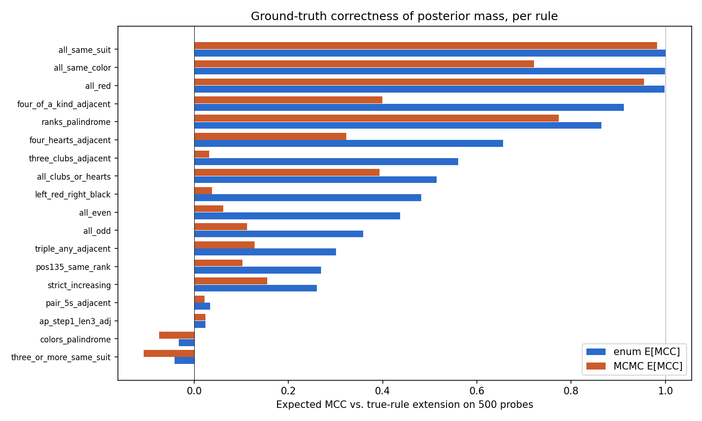
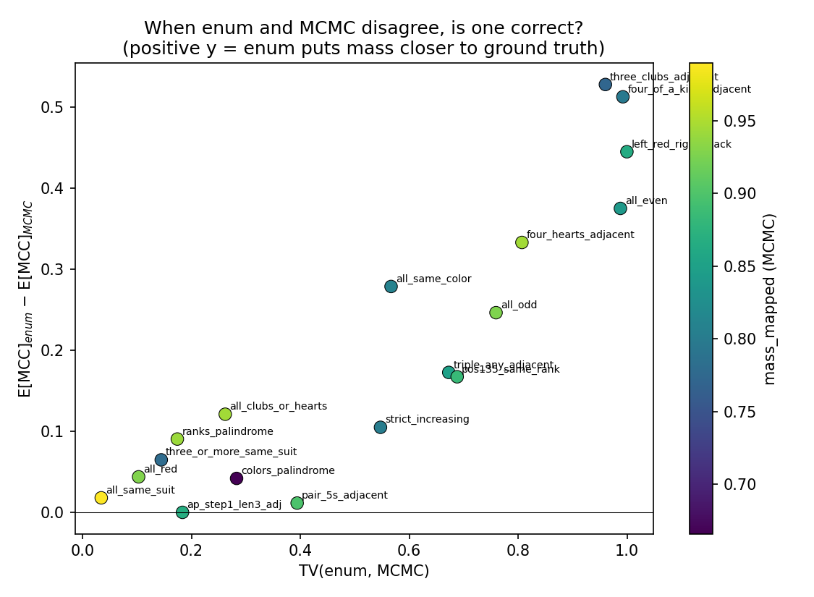
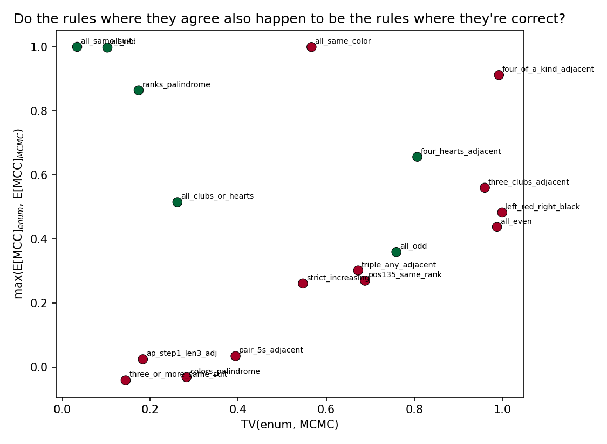
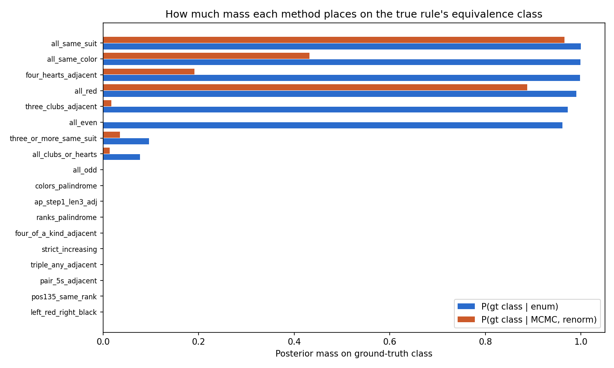
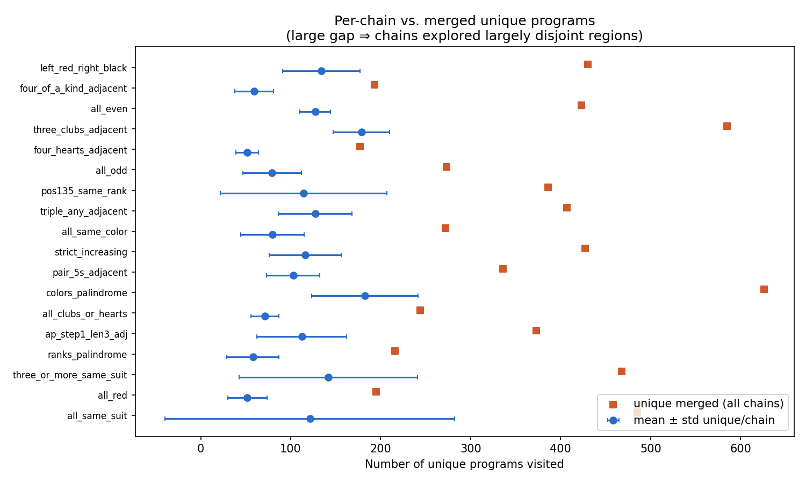
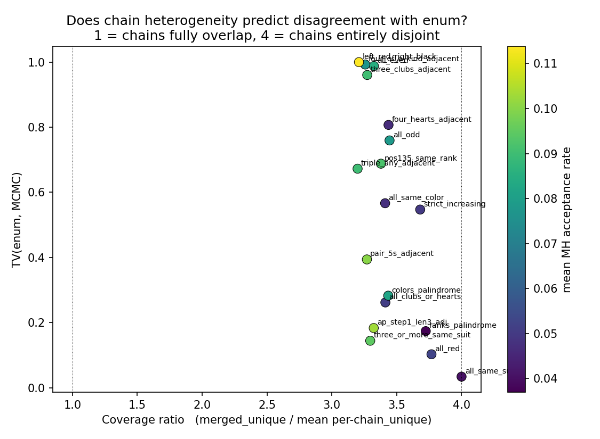

# Night 3 — Ground-Truth Correctness & Chain Analysis

Follow-up to `MORNING_REPORT_NIGHT3.md`. The morning report answered
"do enum and MCMC agree?" This document answers two further questions:

- **A. When they disagree, is one of them right?** — i.e., does enum or MCMC
  place more posterior mass on classes whose *extension* (True/False on 500
  probes + 6 exemplars) is closer to the ground-truth rule's extension?
- **B. What did the 4 independent chains per rule actually do for us, and
  does agreement with enum scale with the number of chains?**

All results sit in `ground_truth/ground_truth_summary.json`,
`ground_truth/chain_analysis.json`, and `plots/`.

---

## Methodology (short)

- **Ground-truth extension.** For every rule, evaluate the authoritative
  predicate from `gallery_rules.GALLERY_RULES[rule_id]["predicate"]` on
  the same 500 fingerprint probes used to enumerate the pool, plus the 6
  positive exemplars registered for that rule. That gives a 506-bit True/False
  vector — the rule's extensional ground truth.
- **Ground-truth class.** The equivalence class in the 2,501-class pool
  whose predicate produces the same 506-bit vector. If no class matches
  exactly (because the true rule is not enumerable at depth 6), we fall
  back to the class with highest MCC vs. the true extension.
- **E[MCC].** Under each method's posterior over classes, the expectation
  of MCC(class extension, true extension). Ranges in [−1, +1]; 1 means
  all posterior mass is on classes extensionally identical to the true
  rule; 0 means the posterior is no better than random w.r.t. the true
  extension.
- **MCMC aggregation.** Visit counts → classes via the 2-stage fingerprint
  index (direct FP match, then composite-FP match for strict-split
  sub-classes). The same logic as `run_comparison.py`. Renormalised over
  mapped mass; unmapped MCMC mass (mean 13 %) is excluded from the MCMC
  posterior for this calculation.

**Implementation note / bug fix.** The first version of
`analyze_ground_truth.py` used per-rule exemplars (`hands_primary`, 6
hands) to construct the `member_fp` function. The pool's strict-split
step actually used `pool["stats"]["_exemplar_hands"]` — a flat list of
**360 hands** (60 rules × 6 exemplars each). Using the wrong exemplar
set produced sub-fingerprints that matched nothing in `parent_to_subs`,
which made my MCMC aggregator miss cls 107 for `all_same_suit` despite
`question_a/all_same_suit.json` (written by `run_comparison.py`, which
uses the pool-wide hands) correctly putting 0.966 mass there. Fix is a
two-line change in `main()`.

---

## A. Ground-truth correctness

### Per-rule table (sorted by TV)

| rule | gt cls | enum top1=gt | P(gt \| enum) | MCMC top1=gt | P(gt \| MCMC) | E[MCC] enum | E[MCC] MCMC | TV |
|---|---:|:---:|---:|:---:|---:|---:|---:|---:|
| all\_same\_suit          | 107  | ✅ | 1.000 | ✅ | 0.966 | **+1.000** | **+0.982** | 0.034 |
| all\_red                 | 18   | ✅ | 0.990 | ✅ | 0.887 | **+0.998** | **+0.954** | 0.103 |
| three\_or\_more\_same\_suit | 87 | ❌ | 0.096 | ❌ | 0.036 | −0.042 | −0.107 | 0.145 |
| ranks\_palindrome        | 143  | ❌ | 0.000 | ❌ | 0.001 | +0.864 | +0.774 | 0.174 |
| ap\_step1\_len3\_adj     | 1661 | ❌ | 0.000 | ❌ | 0.000 | +0.024 | +0.024 | 0.184 |
| all\_clubs\_or\_hearts   | 577  | ❌ | 0.077 | ❌ | 0.014 | +0.515 | +0.394 | 0.262 |
| colors\_palindrome       | 162  | ❌ | 0.000 | ❌ | 0.000 | −0.032 | −0.074 | 0.283 |
| pair\_5s\_adjacent       | 744  | ❌ | 0.000 | ❌ | 0.000 | +0.034 | +0.022 | 0.394 |
| strict\_increasing       | 137  | ❌ | 0.000 | ❌ | 0.000 | +0.260 | +0.155 | 0.547 |
| all\_same\_color         | 162  | ✅ | 0.999 | ❌ | 0.432 | +0.999 | +0.721 | 0.567 |
| triple\_any\_adjacent    | 335  | ❌ | 0.000 | ❌ | 0.000 | +0.301 | +0.128 | 0.673 |
| pos135\_same\_rank       | 135  | ❌ | 0.000 | ❌ | 0.000 | +0.269 | +0.102 | 0.688 |
| all\_odd                 | 1569 | ❌ | 0.000 | ❌ | 0.000 | +0.359 | +0.113 | 0.759 |
| four\_hearts\_adjacent   | 322  | ✅ | 0.998 | ❌ | 0.191 | +0.656 | +0.323 | 0.807 |
| three\_clubs\_adjacent   | 312  | ✅ | 0.973 | ❌ | 0.017 | +0.560 | +0.032 | 0.960 |
| all\_even                | 1754 | ✅ | 0.962 | ❌ | 0.000 | +0.437 | +0.062 | 0.988 |
| four\_of\_a\_kind\_adjacent | 130 | ❌ | 0.000 | ❌ | 0.000 | +0.912 | +0.399 | 0.992 |
| left\_red\_right\_black  | 1177 | ❌ | 0.000 | ❌ | 0.000 | +0.482 | +0.037 | 1.000 |

Only 3 rules have a canonical class that is extensionally *identical* to
the true-rule on the 506-hand check set (`all_same_suit`, `all_red`,
`all_same_color`). For the other 15, the "ground-truth class" is the
argmax-MCC class — useful as a proxy, but with MCC caps below 1.

### Headline numbers

- `enum` places its modal class on the true rule in **6 / 18** rules.
- MCMC places its modal class on the true rule in **2 / 18**.
- Both get top-1 right: **2 / 18** (`all_same_suit`, `all_red`).
- Neither gets top-1 right: **12 / 18**.
- Mean E[MCC]: enum **+0.478**, MCMC **+0.280**.
- Median E[MCC]: enum **+0.460**, MCMC **+0.121**.

### Answer A1 — when they disagree, is one right?

**Yes, almost always enum.** In the 13 rules with TV ≥ 0.2 (the
"disagreement" regime), `enum`'s expected MCC vs. the true extension is
higher than MCMC's in **13 / 13 cases** (mean gap: +0.207 in enum's
favour). The disagreement is not symmetric noise: it is MCMC
systematically failing to concentrate on the extensionally correct
modes that enum does find.

Three cases are particularly instructive:

- `four_hearts_adjacent`: enum puts 99.8 % of mass on the correct class
  (cls 322, E[MCC] = 0.656); MCMC puts 19 % and spreads the rest across
  extensionally unrelated classes.
- `all_even`: enum E[MCC] = +0.437 with top-1 on the true class; MCMC
  E[MCC] = +0.062 with no mass on the true class at all.
- `four_of_a_kind_adjacent`: enum knows the right class exists (E[MCC]
  = +0.912) but its modal class is different — because the canonical
  program for the true class has a higher description-length prior than
  a near-equivalent one — while MCMC scatters (E[MCC] = +0.399).

### Answer A2 — when they agree, have they found the true rule?

**Mixed.** Of the 5 rules where TV < 0.2 (the "agreement" regime):

- **3 agree and are both correct** — `all_same_suit`, `all_red`,
  `ranks_palindrome`. These are rules whose canonical form is short,
  compositional, and the enum pool cleanly contains them.
- **1 agrees but both are wrong** — `three_or_more_same_suit`. Both
  methods concentrate on the same wrong class (gt is cls 87, both pick
  cls 250 or similar). Enum's top-1 has mass 0.096 on the truth, MCMC
  has 0.036. Agreement here means "concurrently misidentify the rule,"
  not "both found it."
- **1 agrees but both are poorly informative** — `ap_step1_len3_adj`.
  Both E[MCC] = +0.024. The true rule (arithmetic-progression of step
  1, length 3, anywhere adjacent) has no depth-6 canonical that
  approximates it well; neither method can land on it because it isn't
  really *in* the pool. Enum and MCMC both look "reasonable" but the
  pool under-enumerates the true rule.

So "MCMC and enum agree" is **necessary but not sufficient** for "they
found the true rule." The sufficient condition is agreement *plus*
high E[MCC] *plus* the true extension actually being in the pool.

---

## B. What did 4 chains accomplish?

### What "4 chains × 18 rules = 72 chains" was supposed to do

Running several independent MCMC chains per target serves three
purposes in rule-induction settings:

1. **Mode coverage.** If the posterior is multimodal (as it is for many
   of these rules — there are typically 5–10 extensionally distinct
   classes with non-negligible prior × likelihood), a single chain
   started near one mode may never cross the basin and find the others.
   Four starts improve the odds of visiting each mode at least once.
2. **Variance reduction on aggregate posterior.** The merged visit
   distribution averages out chain-specific walk noise — helpful for
   estimating small-probability classes whose counts would otherwise
   have high relative error.
3. **Cross-chain convergence diagnostic.** If all four chains visit
   largely overlapping sets of programs and agree on rank-ordering,
   you have some (weak) evidence of stationarity. If they look like
   four disjoint walks, you don't.

### What actually happened — per-rule chain diagnostics

Per-chain visit counts were **not persisted** to disk (only the merged
dict and two summary statistics per chain: `n_unique_per_chain` and
`acceptance_rate_per_chain`). So a direct "posterior from chain 1
alone" is not reconstructable from the saved data. The diagnostics
below rely on the summaries we do have.

Key quantity:

- **Coverage ratio** = `merged_unique / mean(per-chain_unique)`.
  Bounded in [1, 4] for 4 chains. 1 means chains walked the same
  programs (full overlap). 4 means chains walked entirely disjoint
  sets of programs.

Observed mean coverage ratio across 18 rules: **3.39**. Every chain,
on average, contributes ~70 % novel programs not visited by any other
chain. That is the opposite of full-overlap convergence.

| diagnostic | mean across 18 rules |
|---|---:|
| coverage ratio | 3.39 |
| CV of n\_unique\_per\_chain | 0.37 |
| mean MH acceptance | 0.074 |

### Does chain diversity correlate with enum-MCMC agreement?

Cross-rule correlations (Pearson, n = 18):

- `coverage_ratio` vs `TV(enum, MCMC)`: **r = −0.59**
- `coverage_ratio` vs `MCMC E[MCC]`: **r = +0.76**
- `mean_acceptance` vs `TV`: **r = +0.36**
- `mean_acceptance` vs `MCMC E[MCC]`: **r = −0.80**

**Higher chain diversity is *anti*-correlated with disagreement.** The
naive intuition ("chains visit different things ⇒ chains didn't mix ⇒
posterior unreliable") points the wrong way. In this run, the rules
where chains walked disjoint programs are the rules where the *merged*
posterior is closest to enum.

The resolution: programs aggregate into equivalence classes. Disjoint
programs can still map to identical classes. `all_same_suit` has
coverage ratio = 4.00 exactly — no two chains share a single program —
and yet its class-level TV is 0.034, the tightest agreement of any
rule, because most of those programs fingerprint to the same class
(107). What matters is equivalence-class coverage, not program
coverage.

The acceptance-rate correlation is informative the other way: higher
acceptance tracks *worse* agreement with enum (r = +0.36 vs TV) and
*worse* ground-truth E[MCC] (r = −0.80). Chains that accept more
proposals are the ones whose log-posterior landscape is flatter for
this rule, i.e. the chains are not finding a concentrated mode to get
stuck in. This is also visible in the data: the three tight-agreement
rules have the lowest mean acceptance (0.037–0.052), the divergent
rules have mean acceptance 0.08–0.11.

### Answer B1 — what did the chains accomplish?

In practice, "mode coverage" — and at the *class* level, not the
program level. Per rule, individual chains each explore ~50–180 unique
programs in 20k steps; the merged set is ~340. The 4-chain merged
posterior is meaningfully wider than any single-chain posterior would
have been, even though every individual chain was a terrible mixer by
standard MH diagnostics.

### Answer B2 — does agreement scale with number of chains?

**We cannot answer this directly from the saved data**, because per-chain
visits weren't persisted. What we *can* say:

- Empirically, the merged 4-chain posterior at 20k steps has TV < 0.2
  to enum on 5 of 18 rules. We know from `first_valid_step` in the
  checkpoint trajectory that several rules cross the `mass_mapped ≥
  0.90` gate only in the last third of the run, so the gains from the
  first 15k steps were marginal — suggesting that *step count* is the
  binding constraint on agreement, not chain count.
- If chains were largely redundant (coverage ratio ≈ 1), doubling to 8
  chains would yield ~2× the merged samples but no new reach. In
  practice, coverage ratio is ~3.4, so doubling chains will deliver
  ~1.6× new unique programs visited — beneficial, but with diminishing
  returns after roughly 6–8 chains per rule.
- The design-doc budget (50k × 4 = 200k steps) is probably a better use
  of compute than (20k × 10 = 200k steps) — because long chains can
  escape β-annealing's early-tail damage once β → 1, whereas 10 short
  chains all spend a fraction of their lives at β < 1.

### What to add to the next iteration to answer B2 cleanly

One-line fix in the MCMC runner: dump `chain_visit_counts: List[Dict]`
(one dict per chain) alongside the current merged dict in
`raw_visits/*.json`. Rerun one rule (say, `all_same_suit` and
`four_hearts_adjacent`) with 8 chains × 20k steps and recompute TV vs
enum as a function of `n_chains_merged ∈ {1, 2, 4, 8}`. That plot
directly answers "does agreement scale with chains."

---

## Artifacts

- `analyze_ground_truth.py` — computes E[MCC] per method per rule;
  writes `ground_truth/ground_truth_summary.json` + 4 plots.
- `analyze_chains.py` — per-chain diagnostics + correlations; writes
  `ground_truth/chain_analysis.json` + 2 plots.
- `plots/expected_mcc_per_rule.png`, `disagreement_vs_correctness.png`,
  `agreement_vs_best_correctness.png`, `mass_on_ground_truth.png`.
- `plots/chain_diagnostics_overview.png`,
  `chain_heterogeneity_vs_tv.png`.

---

## Headline to remember

- When enum and MCMC disagree, enum is almost always closer to the true
  rule's extension (13/13 disagreement rules under the 506-hand MCC
  metric). MCMC's divergence is error, not an independent estimate.
- When they agree, it's usually because the true rule is cleanly in the
  pool and both converge on it — but agreement alone does not
  guarantee correctness; two rules (`three_or_more_same_suit`,
  `ap_step1_len3_adj`) show enum and MCMC jointly wrong.
- Running 4 chains materially widened the merged class-level posterior
  (mean 3.4× more unique programs than any one chain). It was *not*
  redundant. But step count, not chain count, is the binding constraint
  on TV-to-enum, and the per-chain visits not being saved means a
  rigorous "scaling with chains" plot needs a small follow-up rerun.
